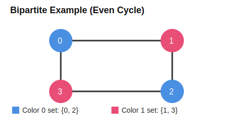
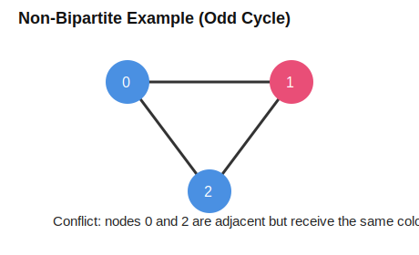

# 🟦🟥 Bipartite Graph

This file covers both standard approaches to check whether a graph is bipartite:

1. Using BFS coloring
2. Using DFS coloring

---

# 1️⃣ What is a Bipartite Graph?

A graph is bipartite if we can color all nodes using only 2 colors such that:

- No two adjacent nodes have the same color.

Equivalent idea:

- A graph is bipartite **iff** it has **no odd-length cycle**.

---

# 2️⃣ Approach 1 — Using BFS

## 🔹 Intuition

- Start from an uncolored node.
- Assign color 0.
- For every neighbor, assign opposite color.
- If a neighbor already has the same color as current node → not bipartite.

Do this for every component (graph may be disconnected).

---

## 💻 Code (C++)

```cpp
#include <bits/stdc++.h>
using namespace std;

bool checkBFS(int start, vector<int> adj[], vector<int>& color) {
    queue<int> q;
    q.push(start);
    color[start] = 0;

    while(!q.empty()) {
        int node = q.front();
        q.pop();

        for(auto nbr : adj[node]) {
            if(color[nbr] == -1) {
                color[nbr] = 1 - color[node];
                q.push(nbr);
            }
            else if(color[nbr] == color[node]) {
                return false;
            }
        }
    }
    return true;
}

bool isBipartite(int V, vector<int> adj[]) {
    vector<int> color(V, -1);

    for(int i = 0; i < V; i++) {
        if(color[i] == -1) {
            if(!checkBFS(i, adj, color)) return false;
        }
    }
    return true;
}
```

---

# 3️⃣ Approach 2 — Using DFS

## 🔹 Intuition

- Recursively color neighbor with opposite color.
- If any adjacent nodes end up with same color → not bipartite.

Again, run for each component.

---

## 💻 Code (C++)

```cpp
#include <bits/stdc++.h>
using namespace std;

bool checkDFS(int node, int col, vector<int> adj[], vector<int>& color) {
    color[node] = col;

    for(auto nbr : adj[node]) {
        if(color[nbr] == -1) {
            if(!checkDFS(nbr, 1 - col, adj, color)) return false;
        }
        else if(color[nbr] == col) {
            return false;
        }
    }
    return true;
}

bool isBipartite(int V, vector<int> adj[]) {
    vector<int> color(V, -1);

    for(int i = 0; i < V; i++) {
        if(color[i] == -1) {
            if(!checkDFS(i, 0, adj, color)) return false;
        }
    }
    return true;
}
```

---

# 4️⃣ Visual Examples

## ✅ Example A: Bipartite (Even Cycle)



This graph has cycle length 4 (even), so 2-coloring is possible.

- Color 0 set: {0, 2}
- Color 1 set: {1, 3}

## ❌ Example B: Not Bipartite (Odd Cycle)



Triangle (3-cycle) is odd. While coloring, nodes 0 and 2 become same color,
but edge (0, 2) exists, so condition fails.

---

# 5️⃣ Dry Run — BFS (Step-by-step)

Use Example A with start node 0.

| Step | Queue | Current | Action | Colors |
|------|-------|---------|--------|--------|
| 1 | [0] | 0 | Color 0 with 0, push neighbors 1 and 3 with color 1 | [0,1,-1,1] |
| 2 | [1,3] | 1 | Visit 2, assign opposite color 0 | [0,1,0,1] |
| 3 | [3,2] | 3 | Neighbor 2 already color 0 (valid) | [0,1,0,1] |
| 4 | [2] | 2 | Neighbors 1 and 3 already color 1 (valid) | [0,1,0,1] |

No conflict found, so graph is bipartite.

---

# 6️⃣ Dry Run — DFS (Step-by-step)

Use Example B (triangle 0-1-2-0), start DFS at node 0 with color 0.

1. `dfs(0, 0)` → color[0] = 0
2. Go to neighbor 1: `dfs(1, 1)` → color[1] = 1
3. Go to neighbor 2: `dfs(2, 0)` → color[2] = 0
4. From node 2, neighbor 0 already has color 0 (same as node 2) and edge (2,0) exists.
5. Conflict detected → return false up recursion.

So triangle graph is not bipartite.

---

# 7️⃣ ⏱ Time & Space Complexity

For both BFS and DFS:

- Time: **O(V + E)**
- Space: **O(V)** (color array + queue/stack)

---

# 8️⃣ 🎯 Interview One-Liner

> Bipartite check = 2-coloring check. If any edge connects same-colored nodes, return false.

